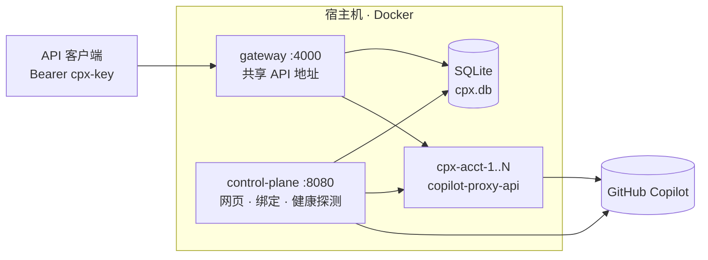
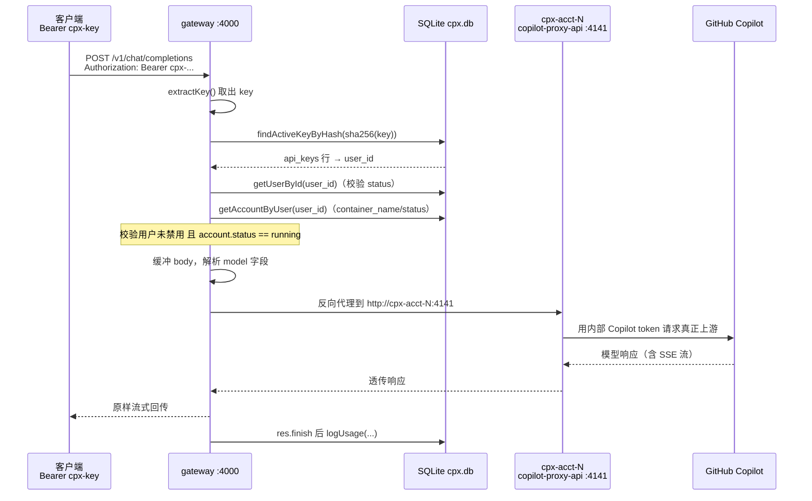

# Copilot Proxy · Multi-tenant

在**同一个共享 API 地址**背后，集中管理多个 GitHub Copilot 账号。
每个团队成员登录平台网页，绑定自己的 GitHub Copilot 账号（通过 GitHub 设备码授权），
并获得一个专属 API key。所有人调用同一个网关地址，用各自的 key 即可访问自己账号下的 Copilot 模型。

> English version: [README.md](README.md)

## 架构



- **control-plane（控制面，`:8080`）** — 平台网页：本地账号登录、管理员用户管理、
  API key 管理、GitHub 设备码绑定。绑定成功后会为每个账号启动一个
  `copilot-proxy-api` 容器（完整兼容 OpenAI + Anthropic + Codex，使用未修改的上游镜像）。
- **gateway（网关，`:4000`）** — 唯一对外的共享 API 地址。把 `Bearer <cpx-key>`
  解析为 用户 → 账号容器，然后反向代理（支持流式）。
- **每账号容器 `cpx-acct-<id>`** — 每个账号一个 `copilot-proxy-api`，作为宿主机 Docker
  守护进程上的兄弟容器，加入 `cpx-net` 网络。仅内部可见，不向宿主机暴露端口。
- **SQLite（`./data/cpx.db`）** — 用户、哈希后的 API key、加密的 GitHub token、用量日志。

GitHub token 使用 `CPX_MASTER_KEY` 通过 AES-256-GCM 加密存储。

### 请求数据流

一次客户端调用按 `key → 用户 → 账号 → 容器` 逐跳解析（全部是 SQLite 查询），
然后网关把请求以字节流方式反向代理到该账号对应的上游代理容器，并在响应结束时
记录一行用量日志。



## 快速开始

```bash
cp .env.example .env
# 编辑 .env：设置 CPX_MASTER_KEY（64位十六进制）、CPX_ADMIN_PASS、CPX_SESSION_SECRET。
node -e "console.log(require('crypto').randomBytes(32).toString('hex'))"  # 生成主密钥

docker compose up --build -d
```

然后：

1. 打开 `http://localhost:8080`，用初始管理员账号登录（`CPX_ADMIN_USER` /
   `CPX_ADMIN_PASS`）。
2. 管理员 → 为团队成员创建用户。
3. 作为用户：点击 **Connect GitHub Copilot** → 打开页面给出的链接，输入验证码，
   完成授权。对应的账号代理容器会自动启动。
4. 在面板上 **Create API key**（只显示一次，请立即复制）。
5. 使用统一的 API 地址：

```bash
curl http://localhost:4000/v1/models -H "Authorization: Bearer YOUR_CPX_KEY"
curl http://localhost:4000/v1/chat/completions \
  -H "Authorization: Bearer YOUR_CPX_KEY" \
  -H "Content-Type: application/json" \
  -d '{"model":"gpt-4o","messages":[{"role":"user","content":"hi"}]}'
```

## 本地开发（两个服务不走 Docker）

```bash
npm install
# 终端 1（dev 脚本会自动固定一个共享的绝对 DB 路径）
npm run dev:cp
# 终端 2
npm run dev:gw
```

> 两个服务必须指向**同一个** SQLite 文件。`npm -w <pkg> run` 会把工作目录切到子包目录，
> 因此相对的 `CPX_DB_PATH` 会被解析到各自的包目录，导致数据库被悄悄分裂。`dev:*`
> 脚本和 compose 文件都使用绝对路径以规避此问题。

注意：绑定时仍会通过本地 Docker 守护进程启动真实的 `copilot-proxy-api` 容器，
网关通过容器名访问它们 —— 所以要端到端代理，需让网关运行在 `cpx-net` 内
（即通过 `docker compose` 启动）。

## 网关错误码

网关返回可预测的状态码。控制面有一个后台健康探测，每 30 秒探测一次每个账号并校正
`account.status`，因此账号登出 / 不健康时会稳定返回干净的 `503`，而不是时好时坏的
`502` / `401`。

| HTTP | `error.type` | 何时出现 |
| --- | --- | --- |
| 401 | （缺失/无效） | 没有 key、未知 key、或已吊销的 key |
| 403 | （未绑定） | key 有效，但该用户尚未绑定 Copilot 账号 |
| 503 | `account_not_ready` | 账号处于 `pending` / `stopped` / `error`（例如 GitHub 已登出——容器无法启动） |
| 502 | `upstream_unavailable` | 容器本应运行却不可达（临时故障）。内部容器名绝不外泄 |
| 200 + 上游状态码 | — | 健康；上游 copilot-proxy-api 的响应原样透传 |

说明：
- 当某个 GitHub 账号登出 / token 被吊销时，对应的 `copilot-proxy-api` 容器会在启动时
  的 token 校验失败并退出，因此健康探测会把账号标记为 `stopped`/`error` → 网关返回 `503`。
- 在网关上设置 `CPX_VERBOSE=1`，可在服务端日志中记录 `502` 背后真实的上游错误。

## Token 计量

网关的 `usage_logs` 表**每次调用记录一行**（谁 / 哪个账号 / 路径 / 模型 / HTTP 状态码 /
时间戳）—— **不**存储 token 数量。可直接查询：

```bash
docker compose exec -T control-plane node -e "
const db=require('better-sqlite3')('/app/data/cpx.db');
console.table(db.prepare('SELECT id,user_id,account_id,path,model,status_code,created_at FROM usage_logs ORDER BY id DESC LIMIT 20').all());
"
```

token 消耗本身由**上游模型在响应体里返回**，而不是由代理统计。具体读哪个字段取决于你调用的接口：

| 接口 | 路径 | 响应 JSON 中的 token 字段 |
| --- | --- | --- |
| OpenAI Chat Completions | `/v1/chat/completions` | `usage.prompt_tokens`、`usage.completion_tokens`、`usage.total_tokens` |
| OpenAI Responses | `/v1/responses` | `usage.input_tokens`、`usage.output_tokens`；另有 `copilot_usage.token_details[]`（按类型给出 `token_count`：`input` / `output` / `cache_read`）和 `copilot_usage.total_nano_aiu`（计费单位） |
| Anthropic Messages | `/v1/messages` | `usage.input_tokens`、`usage.output_tokens`、`usage.cache_read_input_tokens`（缓存命中） |

说明：
- **流式**请求下，OpenAI 只有在你传了 `"stream_options": {"include_usage": true}` 时，
  才会在最后一个 chunk 里带上 `usage`；Anthropic 默认会在 `message_delta` / 末尾事件里返回 usage。
- 网关目前**不**把这些字段解析进数据库（它原样反向代理字节流）。若要按 token 计量，
  要么让客户端自己读取每次响应里的 `usage`，要么扩展网关嗅探末尾的 `usage`，
  并在 `usage_logs` 中新增 `prompt/completion/total` 列。
- 该链路上 prompt caching 是真实生效的：配合 Anthropic 的 `cache_control`，热调用会显示
  `cache_read_input_tokens` > 0，计费 input 降到只剩新增的 token。

## 说明 / 限制（demo 阶段）

- 会话存储在内存中；重启 control-plane 会让用户登出。
- 容器常驻运行（不做空闲停止）。10–50 个账号没问题；规模更大时注意内存
  （每个空闲代理约 40–90 MB）。
- 跨多个账号的大量自动化流量可能触发 GitHub 滥用检测。
- 本项目依赖逆向的 Copilot API；请自行确认是否符合 GitHub Copilot 条款。
